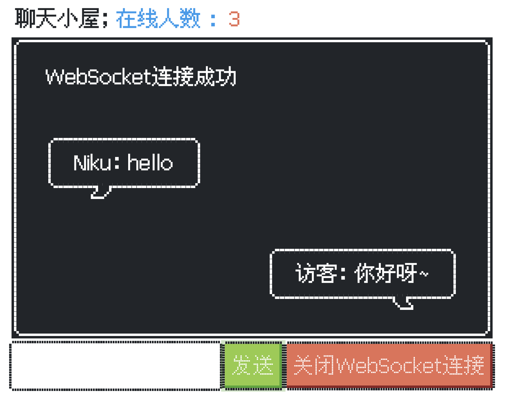

# Spring Boot + web socket IM 实时聊天

本示例是整合的 Tomcat WebSocket （Tomcat7 以后开始支持 websocket 协议）


## 版本依赖

|技术栈|版本|
| --------------- | -------------------------- |
|Spring Boot | 2.7.0 |
|Fastjson | 1.2.62 |
|NES.css |2.3.0|
|Maven|3.8.3|

## 项目结构
```bash
.
├── SocketApplication.java
├── config
│   └── WebSocketConfiguration.java
├── context
│   └── WebSocketContext.java
├── controller
│   └── WebSocketTestController.java
├── enums
│   └── MsgTypeEnum.java
├── message
│   ├── ChatCountMessage.java
│   ├── ChatMsgMessage.java
│   └── Message.java
└── server
    └── WebSocketServer.java

```
流程可以简单描述如下


## 项目启动 & 效果展示
运行启动类即可 `SocketApplication` 

启动后访问 <http://127.0.0.1:8080/> 即可体验

可以开多个窗口，互相聊天


